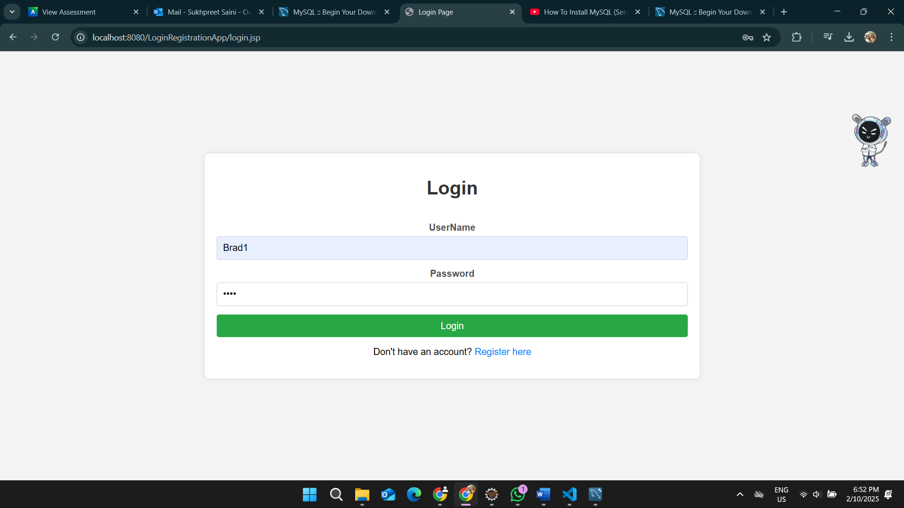
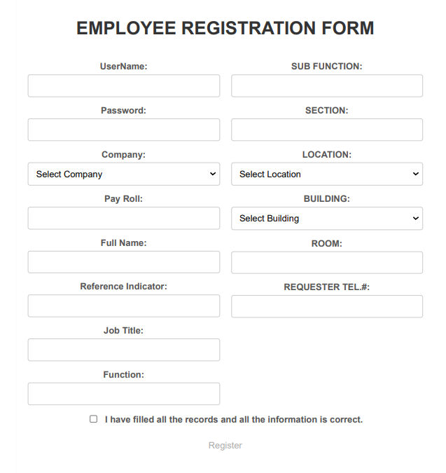
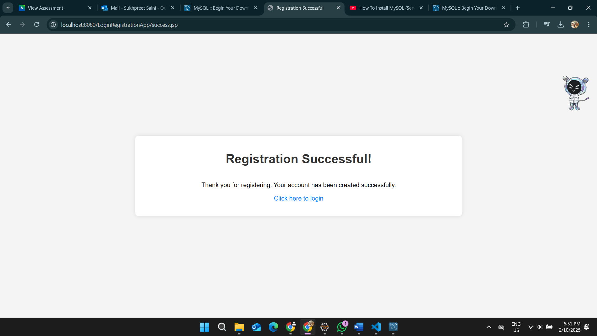

# Assignment 3: Web Login & Registration System 📝💻

## Overview 🌐

This project consists of a dynamic web application that allows users to register, log in, and perform employee registration. It is built using Eclipse, JSP, HTML, and a DAO layer for database interaction. The project also incorporates form validation to enforce rules on user input.

### Project Breakdown 🔧

- **PART A**: Create a dynamic web project in Eclipse with login and register forms. 📝
- **PART B**: Add input validation for fields such as username, password, and required fields. 🔒
- **PART C**: Implement DAO code and connect the web forms to a database to allow user login and employee registration. 📊

---

## Features ✨

### Part A: Login & register Forms 🔑

In this part of the project, two forms were created using HTML/JSP pages for login and register functionality. These forms are the entry point for the users to either sign in or create a new account.

**Features**:
- Login Form 🔑
- register Form ✍️

**Images**:
  
  
_Screenshot of the Login form_ 👨‍💻

  
_Screenshot of the register form_ ✨

  
_Screenshot of the Success_ ✨

### Part B: Validation Rules ✅

The code was modified to enforce validation on the user input. The following rules were applied:

- **Username**: Must be exactly 5 characters. 🔠
- **Password**: Must be alphanumeric and allow only numbers, `$`, and `_` (underscore). 🔒
- **Required Fields**: All fields must be filled out. ✅
- **No Special Characters**: Special characters are not allowed in any input fields. 🚫

### Part C: Database Integration and DAO Code 🗃️

This part involves the creation of DAO code that allows interaction with a database for storing user details. Upon successful login, users can register as employees, and their data will be inserted into the database.

The project is set up to run with **Wildfly** or **Apache Server**. 🌍

---

## Getting Started 🚀

To get started with this project locally, follow the steps below.

### Prerequisites 🔑

- **Eclipse IDE** for Java EE Developers 🧑‍💻
- **Apache Tomcat** server 🖥️
- **JDK 8+** ☕
- **MySQL** or any relational database 🗄️
- **JDBC** Driver for database connection ⚙️

### Setup 🔧

1. **Clone the repository:**
   ```bash
   git clone https://github.com/SUKH2022/LoginRegistrationApp
   ```

2. Import the project in Eclipse:

- Open Eclipse IDE. 👩‍💻
- Go to File > Import. 📂
- Choose General > Existing Projects into Workspace. 🛠️
- Select the project folder and finish. ✅

3. Configure Database:

- Set up a MySQL or similar database with the appropriate schema for storing user and employee data. 🗄️
- Update the database connection settings in the DAO class to reflect your local environment. ⚙️

4. Run the Application:

- Configure Apache Tomcat as your runtime in Eclipse. 🌍
- Right-click on the project and select Run on Server. ▶️

5. Access the Web Application:

Once the server is running, open a browser and go to:
    ```bash
    http://localhost:8080/LoginRegistrationApp/login.jsp
    ```
